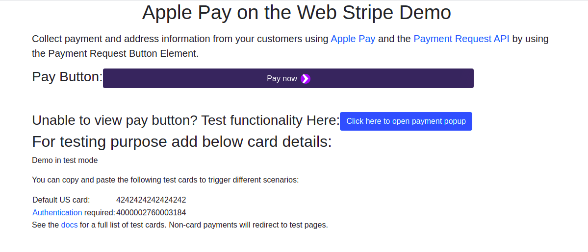

# Stripe with Apple Pay Demo for Web

This demo features a sample payment request button that uses Stripe Elements, Collect payment and address information from your customers using Apple Pay and the Payment Request API (Chrome) by using the Payment Request Button Element.

If you’re running a compatible browser, this demo also showcases for now Apple Pay for a seamless payment experience.

**You can see this demo app running in test mode on [meetsoni15.github.io/stripe-with-apple-pay-web/](https://meetsoni15.github.io/stripe-with-apple-pay-web/).**

## Overview

**If you are unable to see payment button, add payment method in your browser or if you want to see how payment option really look please click on test funality button, It seems as google/apple pay payment popup. From there add payment method as well.

You can copy and paste the following test cards to trigger different scenarios:

Default US card:	4242424242424242
Authentication required:	4000002760003184